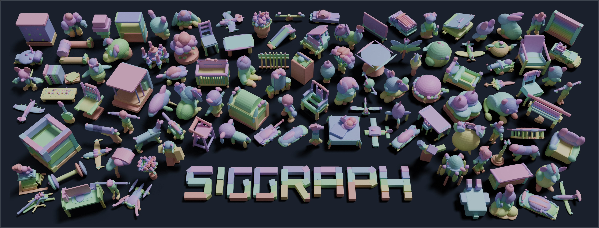

# PrimitiveAnything: Human-Crafted 3D Primitive Assembly Generation with Auto-Regressive Transformer

<a href="https://primitiveanything.github.io/"></a>&ensp;<a href="https://arxiv.org/abs/2505.04622"></a>&ensp;<a href="https://huggingface.co/hyz317/PrimitiveAnything"></a>&ensp;<a href="https://huggingface.co/spaces/hyz317/PrimitiveAnything"></a>

<div align="center">

**Jingwen Ye<sup>1\*</sup>, [Yuze He](https://hyzcluster.github.io/)<sup>1,2\*</sup>, [Yanning Zhou](https://amandaynzhou.github.io/)<sup>1†</sup>,  Yiqin Zhu<sup>1</sup>, Kaiwen Xiao<sup>1</sup>, [Yong-Jin Liu](https://yongjinliu.github.io/)<sup>2†</sup>, Wei Yang<sup>1</sup>, Xiao Han<sup>1†</sup>**

<sup>1</sup>Tencent AIPD &ensp;&ensp;<sup>2</sup>Tsinghua University

<sup>\*</sup>Equal Contributions &ensp;&ensp;<sup>†</sup>Corresponding Authors   

</div>



## 🔥 Updates

**[2025/05/07]** test dataset, code, pretrained checkpoints and Gradio demo are released!


## 🔍 Table of Contents

- [⚙️ Deployment](#deployment)
- [🖥️ Run PrimitiveAnything](#run-pa)
- [📝 Citation](#citation)


<a name="deployment"></a>

## ⚙️ Deployment

Set up a Python environment and install the required packages:

```bash
conda create -n primitiveanything python=3.9 -y
conda activate primitiveanything

# Install torch, torchvision based on your machine configuration
pip install torch==2.1.0 torchvision==0.16.0 --index-url https://download.pytorch.org/whl/cu118

# Install other dependencies
pip install -r requirements.txt
```

Then download data and pretrained weights:

1. **Our Model Weights**: 
   Download from our 🤗 Hugging Face repository ([download here](https://huggingface.co/hyz317/PrimitiveAnything)) and place them in `./ckpt/`.

2. **Michelangelo’s Point Cloud Encoder**: 
   Download weights from [Michelangelo’s Hugging Face repo](https://huggingface.co/Maikou/Michelangelo/tree/main/checkpoints/aligned_shape_latents) and save them to `./ckpt/`.

3. **Demo and test data**:

   Download from this [Google Drive link](https://drive.google.com/file/d/1FZZjk0OvzETD5j4OODEghS_YppcS_ZbM/view?usp=sharing), then decompress the files into `./data/`; or you can download from our 🤗 Hugging Face datasets library:

```python
from huggingface_hub import hf_hub_download, list_repo_files

# Get list of all files in repo
files = list_repo_files(repo_id="hyz317/PrimitiveAnything", repo_type="dataset")

# Download each file
for file in files:
    file_path = hf_hub_download(
        repo_id="hyz317/PrimitiveAnything",
        filename=file,
        repo_type="dataset",
        local_dir='./data'
    )
```

After downloading and organizing the files, your project directory should look like this:

```
- data/
    ├── basic_shapes_norm/
    ├── basic_shapes_norm_pc10000/
    ├── demo_glb/                   # Demo files in GLB format
    └── test_pc/                    # Test point cloud data
- ckpt/
    ├── mesh-transformer.ckpt.60.pt # Our model checkpoint
    └── shapevae-256.ckpt           # Michelangelo ShapeVAE checkpoint
```


<a name="run-pa"></a>

## 🖥️ Run PrimitiveAnything

### Demo

```bash
python demo.py --input ./data/demo_glb --log_path ./results/demo
```

**Notes:**

- `--input` accepts either:
  - Any standard 3D file (GLB, OBJ, etc.)
  - A directory containing multiple 3D files
- For optimal results with fine structures, we automatically apply marching cubes and dilation operations (which differs from testing and evaluation). This prevents quality degradation in thin areas.

### Testing and Evaluation

```bash
# Autoregressive generation
python infer.py

# Sample point clouds from predictions  
python sample.py

# Calculate evaluation metrics
python eval.py
```


<a name="citation"></a>

## 📝 Citation

If you find our work useful, please kindly cite:

```
@inproceedings{ye2025primitiveanything,
  title={PrimitiveAnything: Human-crafted 3D primitive assembly generation with auto-regressive Transformer},
  author={Ye, Jingwen and He, Yuze and Zhou, Yanning and Zhu, Yiqin and Xiao, Kaiwen and Liu, Yong-Jin and Yang, Wei and Han, Xiao},
  booktitle={Proceedings of the Special Interest Group on Computer Graphics and Interactive Techniques Conference Conference Papers},
  pages={1--12},
  year={2025}
}
```

